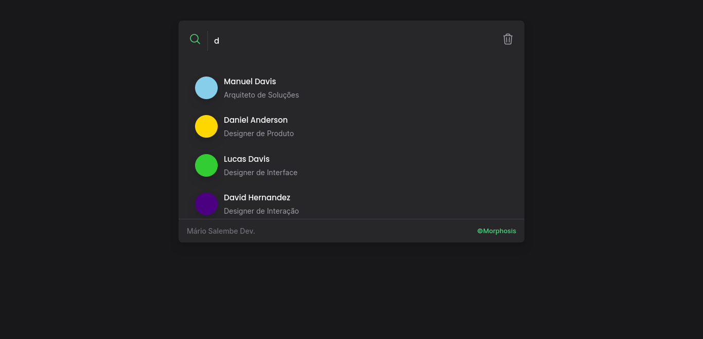
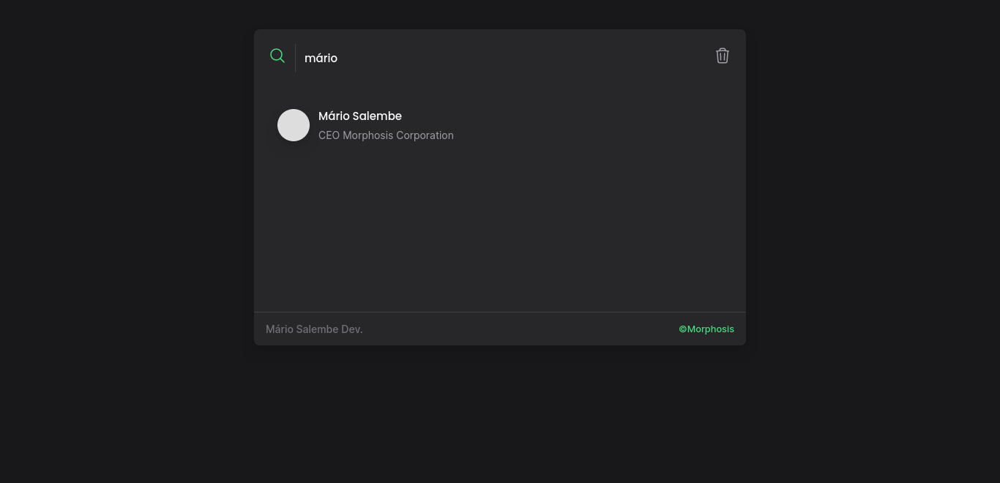
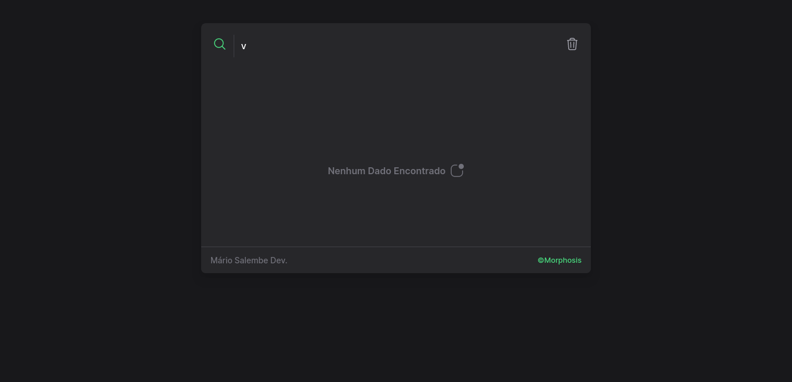

# Card-Feature-Search

Esta Feature de Pesquisa está Integrada á uma API Local que Fornece os Dados de Usuários para Pesquisa
e com animaçẽs CSS feitas á mão.

# Tecnologias
--- Vue.JS
--- Vite.js
--- TailwindCSS
--- Axios

# Imagens

# Links

Veja como a Feature fica no seu Dispositivo: https://feature-search.vercel.app/  
API-JSON Utilizada no Project: https://json-api-fswv.onrender.com/users
